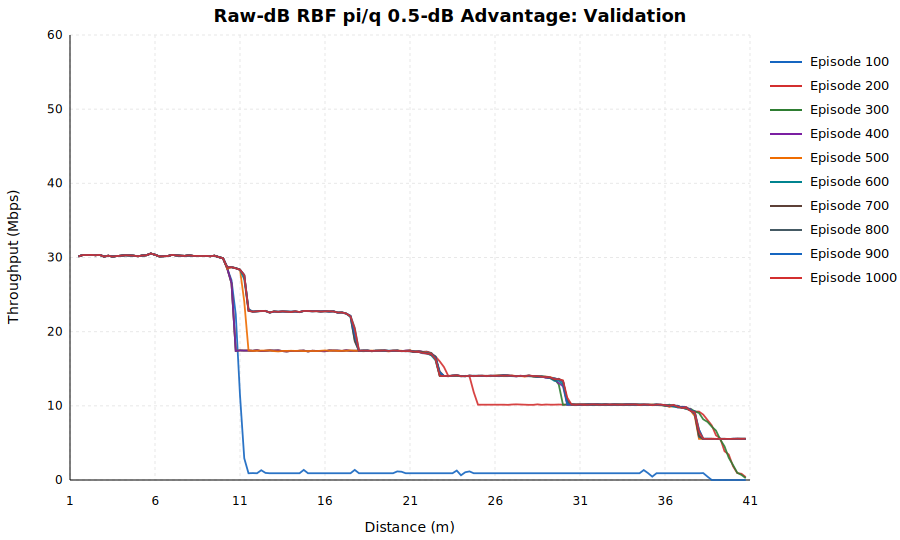
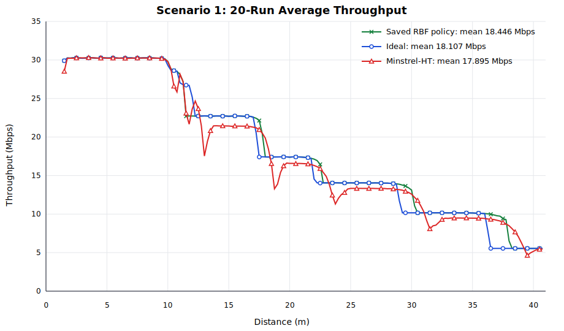
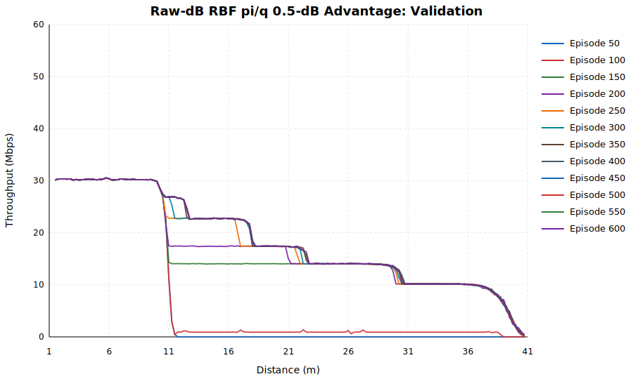

# Offline REINFORCE 成功实验备份

备份时间：2026-07-22（Asia/Shanghai）。

本目录保存当前 1000 轮成功模型、对应 offline 代码、训练记录与曲线，
并归档上一次 600 轮六档策略实验用于对比。

## 已知问题：MCS5 探索样本难以恢复目标策略

当前行为策略确实是两阶段采样：30% 的 20 包决策窗口在 MCS0-MCS7
中均匀随机选择，其余 70% 按网络 softmax 策略 `pi` 采样。该过程的
边际动作概率为：

```text
q(a|s) = 0.7*pi(a|s) + 0.3/8
```

`q` 是对实际两阶段采样概率的计算，不是把 0.3 直接叠加进每次
softmax 采样步骤。

训练使用 `rho=detach(pi/q)` 修正 epsilon 带来的采样分布偏差。它保证的是
目标策略 `pi` 的无偏策略梯度，但不保证一个已经被 `pi` 压到接近零的
动作能借助 epsilon 快速恢复。例如 `pi(MCS5)=0.0001` 时：

```text
q(MCS5)   = 0.7*0.0001 + 0.3/8 ~= 0.03757
rho(MCS5) = pi/q ~= 0.00266
```

因此，epsilon 仍会实际采到 MCS5，但其探索样本的策略梯度权重可能只有
正常量级的千分之几。episode 1000 在 11.25-12.49 m（22.75-21.40 dB）的
实测中，MCS4 有 129 个样本、平均 reward 10.91；MCS5 只有 3 个样本，
但平均 reward 为 11.75。这表明 MCS5 没有进入最终贪心策略，并不能直接
解释为它的局部 reward 更差；更可能是奖励差距较小、分箱内样本稀少、
softmax 早期饱和与严格 `pi/q` 修正共同造成的恢复困难。

后续若验证该假设，应从未饱和的较早 checkpoint 进行受控对照，比较严格
`pi/q`、设置 importance weight 下限、以及高熵后退火三种方案。设置下限会
引入有意的偏差，因此必须作为独立改进实验，不应改写本备份的基准结果。

## 目录内容

- `code/`：当前 1000 轮实验使用的 Python/C++ 源码快照。
- `models/current_1000/`：最终 policy、episode 1000 policy 和可续训 checkpoint。
- `results/current_1000/`：1000 行训练 history 和每 100 轮冻结验证 SVG。
- `results/comparison_20run/`：当前模型、Ideal 和 Minstrel-HT 各 20 轮的对比统计与 SVG。
- `archive/previous_600/`：上一次 600 轮实验的模型、checkpoint、history 和 SVG。

`current_1000` 中的 final、episode1000 和 checkpoint policy 已逐张量校验完全一致，
checkpoint 记录的 episode 为 1000。

## 当前成功实验（1000 轮）

### 场景参数

- ns-3 构建：`default`。
- 移动轨迹：起始 1 m，速度 0.5 m/s，仿真 80 s，有效范围约 1-41 m。
- 业务：60 Mbps UDP，1420-byte payload，20 MHz，单空间流。
- A-MPDU：关闭。
- 动作窗口：每个 MCS 保持至 20 个完成包。
- 动作空间：HT MCS0-MCS7。

### 状态和网络

- SNR 使用 Raw-dB RBF：中心 5-52 dB，间隔 0.5 dB，`sigma=0.6 dB`。
- 95 个 RBF 特征 + 5 个尾部状态，总输入维度 100。
- 网络：`100 -> 256 -> 256 -> 256 -> 8`，ReLU，159,496 个参数。
- 逐窗口推理在 CPU policy 副本上执行，整个 episode 结束后在 CUDA 上批量更新。

### 奖励与训练

奖励为：

```text
reward = completed_packets
       * ((mcs + 2) / 9)
       * (window_goodput / reference_goodput[mcs])^3
```

参考表不再使用 REINRATE 原表。在 1 m 固定距离下，MCS0-MCS7 分别强制运行
40 s，使用“完整 20 包窗口最大 goodput 向上取 0.1 Mbps”的统一规则：

```text
[5.7, 10.6, 14.8, 18.5, 24.6, 29.4, 31.7, 33.6] Mbps
```

校准数据中八档 `(goodput/reference)^3` 均不超过 1。

- `gamma=0`，使用当前窗口即时奖励。
- 完整 80 s 轨迹内冻结策略，每轮结束后只执行一次 Adam 更新。
- 学习率 `1e-4`，`epsilon=0.3`，entropy coefficient `0.05`。
- 行为策略 `q=(1-epsilon)*pi+epsilon/8`，使用 `detach(pi/q)` importance correction。
- 95 个 0.5 dB 有效 SNR 区和 1 个无效 SNR 区分别计算：
  `adv=(reward-mean_bin)/(std_bin+1e-8)`。
- 每区 loss 先求均值，再对非空区等权平均。
- agent/train seed 从 774015 开始，冻结 validation seed 为 884015。

### 里程碑结果

```text
episode  throughput(Mbps)  entropy   冻结策略动作
100       7.920653         0.807146  MCS7/MCS3/MCS2/MCS1（局部短区）
200      16.814381         0.223918  MCS7/MCS3/MCS2/MCS1
300      17.281577         0.069846  MCS7/MCS3/MCS2/MCS1
400      17.366851         0.080268  MCS7/MCS3/MCS2/MCS1/MCS0
500      17.562271         0.140322  MCS7/MCS6/MCS3/MCS2/MCS1/MCS0
600      18.419734         0.114375  MCS7/MCS6/MCS4/MCS3/MCS2/MCS1/MCS0
700      18.437713         0.065503  同七档
800      18.458135         0.055510  同七档
900      18.448065         0.050932  同七档
1000     18.452523         0.043429  同七档
```

episode 1000 的主要距离分段：

```text
1.25-10.07 m   MCS7
10.07-11.24 m  MCS6
11.25-17.66 m  MCS4
17.67-22.49 m  MCS3
22.49-30.07 m  MCS2
30.08-37.81 m  MCS1
37.82-41.00 m  MCS0
```

600-1000 轮动作集合和主要边界稳定，验证吞吐量稳定在
18.42-18.46 Mbps。episode 1000 梯度范数为 0.01986，可判定收敛。
贪心策略中唯一未使用的是 MCS5。



### 20 轮冻结推理对比

使用同一组 20 个 seed，对已保存的 episode 1000 policy、
`IdealWifiManager` 和 `MinstrelHtWifiManager` 分别运行完整 80 s、1-41 m
场景。三者均关闭 A-MPDU，业务和信道参数与训练场景一致。

```text
Saved RBF policy  18.446217 Mbps
Ideal             18.106611 Mbps
Minstrel-HT       17.894501 Mbps
```

图中使用绿色 `×` 表示已保存模型，蓝色圆形表示 Ideal，红色三角形表示
Minstrel-HT；图例同时显示三者的 20 轮全程平均吞吐量。



## 上一次成功实验（600 轮对照）

这组实验使用旧参考表，MCS 奖励系数为 `(mcs+1)/8`。其他核心设置与
当前方案一致：80 s 完整轨迹、95 个 0.5 dB advantage 区、`pi/q`、
entropy 0.05、每轮一次更新。

### 里程碑结果

```text
episode  throughput(Mbps)  entropy   冻结策略动作
50        7.284780         1.854127  MCS7
100       7.920365         0.725322  MCS7/MCS2/MCS1（边界尚不稳定）
150      16.380981         0.474664  MCS7/MCS2/MCS1
200      17.186241         0.359002  MCS7/MCS3/MCS2/MCS1
250      18.064269         0.280056  MCS7/MCS4/MCS3/MCS2/MCS1
300      18.291754         0.206425  MCS7/MCS5/MCS4/MCS3/MCS2/MCS1
350      18.449360         0.114717  同六档，MCS5 区继续扩大
400      18.466324         0.078855  同六档，开始平台化
450      18.469636         0.066358  同六档
500      18.470931         0.061690  同六档
550      18.478118         0.044126  同六档
600      18.484014         0.045809  同六档
```

episode 600 距离分段：

```text
1.25-10.32 m   MCS7
10.32-12.49 m  MCS5
12.50-17.79 m  MCS4
17.80-22.45 m  MCS3
22.48-30.34 m  MCS2
30.35-41.00 m  MCS1
```

该实验达到 18.484 Mbps，但因旧奖励与参考值偏好 MCS1，远端没有 MCS0。
归档的旧模型应与当时的旧奖励/参考配置配套理解，不应直接当作当前配置的可续训 checkpoint。



## 当前模型文件

- 推理/评估：
  `models/current_1000/reproduction-scenario1-offline-full-rbf05dbadv-piq-entropy05-rewardmcs2over9-500-final.pt`
- episode 1000 快照：
  `models/current_1000/reproduction-scenario1-offline-full-rbf05dbadv-piq-entropy05-rewardmcs2over9-500-episode1000.pt`
- 包含 Adam 和 RNG 状态的续训 checkpoint：
  `models/current_1000/reproduction-scenario1-offline-full-rbf05dbadv-piq-entropy05-rewardmcs2over9-500-checkpoint.pt`

文件名中保留了最初的 `-500` 前缀，但上述三个文件和 history/SVG 的
实际终点都是 episode 1000。
