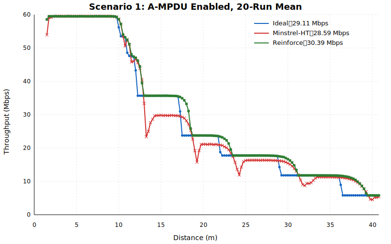

# 场景1开启聚合（逐 A-MPDU 判定）成功实验归档

归档时间：2026-07-23（Asia/Shanghai）。

本目录保存训练到 episode 750 的冻结 Reinforce 模型、训练历史、对应源码快照，以及 Reinforce、Minstrel-HT、Ideal 使用同一组20个随机种子的完整评估结果。对比 SVG 中的每条曲线都是20轮在相同距离采样点上的算术均值，不是单轮结果。

## 目录结构

- `code/`：训练、推理、ns-3 场景、速率控制环境、绘图和20轮评估代码快照。
- `models/`：episode 750 的 final、best 和包含 Adam/RNG 状态的 checkpoint。
- `results/training/`：750轮训练 history 和训练统计图。
- `results/comparison_20run/`：20轮逐轮摘要、逐距离均值 CSV 和总图。
- `results/comparison_20run/raw/`：三种算法各20轮的原始距离—吞吐量 CSV，共60个文件。

三个模型文件中的策略张量已经逐张量验证完全一致；checkpoint 同时记录 `episode=750` 和 `gradient_updates=750`。

## 网络与仿真场景

- ns-3：3.36.1，`default` 构建。
- 拓扑：单 AP、单 STA；AP 位于 `(0,0,0)`，STA 从 `(1,0,0)` 沿 x 轴远离 AP。
- 移动速度：0.5 m/s；仿真80 s，距离范围约1–41 m。
- Wi-Fi：IEEE 802.11n、5 GHz、信道36、20 MHz、单空间流。
- PHY：YansWifiPhy，NistErrorRateModel；前导检测模型关闭。
- 发射功率：20 dBm，单功率等级；接收机噪声系数0 dB。
- 信道：ConstantSpeedPropagationDelayModel + LogDistancePropagationLossModel。
- 路损：1 m 参考损耗66.6777 dB，路径损耗指数3。
- 业务方向：AP 到 STA 的持续 UDP 下行。
- UDP负载：60 Mbps，payload 1420 bytes，0.5 s 开始，80 s 结束。
- 吞吐量采样：每0.5 s一次；每轮158个采样点，图中距离为1.50–40.75 m。
- A-MPDU：开启，`BE_MaxAmpduSize=65535` bytes。
- 动作空间：HT MCS0–MCS7；控制帧使用 HtMcs0。
- Reinforce 决策粒度：每个完成的 PPDU/A-MPDU 后交换一次 observation/action，并为下一个 A-MPDU 选择 MCS。

Minstrel-HT 使用 `ns3::MinstrelHtWifiManager`，Ideal 使用 `ns3::IdealWifiManager`。两种基线与 Reinforce 使用完全相同的拓扑、业务、信道、移动、A-MPDU 和 seed；它们不启用 ns3-ai 决策接口。

## Reinforce 模型

### 状态与网络

- SNR 转为 dB 后使用95个 RBF 特征：中心5–52 dB、间隔0.5 dB、`sigma=0.6 dB`。
- 额外5维：SNR有效标志、归一化竞争窗口、当前MCS、按60.9 Mbps归一化的吞吐量、成功MPDU比例。
- 输入维度100，输出为MCS0–MCS7的8维 softmax 概率。
- 网络：`100 → 256 → 256 → 256 → 8`，隐藏层使用 ReLU。
- 参数量：159,496；线性层使用 Xavier Uniform 初始化。

### 奖励和训练

逐 A-MPDU 奖励为：

```text
reward = attempted_mpdus
       * ((mcs + 2) / 9)
       * (ampdu_goodput / reference_goodput[mcs])^3
```

A-MPDU 开启时 MCS0–MCS7 参考 goodput 为：

```text
[5.9, 12.0, 18.1, 24.2, 36.4, 48.7, 54.8, 60.9] Mbps
```

- 每个80 s episode 内冻结策略，episode 结束后进行一次 Adam 更新。
- 学习率 `1e-4`，训练 epsilon `0.3`，entropy coefficient `0.05`。
- checkpoint 保存的 `gamma=0.99`；本 RBF loss 直接使用逐 A-MPDU 即时 reward，并不进行跨决策折扣。
- 行为采样：30%均匀随机动作，70%从策略 softmax 分布采样。
- 行为概率 `q=(1-epsilon)*pi+epsilon/8`，actor loss 使用 `detach(pi/q)` importance correction。
- 按96个 SNR 区计算 advantage：95个0.5 dB RBF区和1个无效SNR区；每区内部标准化后对非空区等权平均。
- 推理使用CPU策略副本；训练时整轮张量和优化器更新运行在CUDA设备。
- agent/train seed 从774015开始，episode `e` 的训练 seed 为 `774015+e-1`。
- 评估使用冻结贪心策略，不启用 epsilon 探索，也不更新参数。

## 20轮均值评估

种子由 Python `random.Random(20260723)` 从 `[1, 2,000,000,000)` 无放回抽取。三种算法对每个 seed 各运行一次，共60次完整仿真。

20轮全程采样吞吐量均值：

```text
Reinforce    30.393600 Mbps
Ideal        29.111932 Mbps
Minstrel-HT  28.590933 Mbps
```

逐轮数值位于 `results/comparison_20run/reinforce-ampdu-perdecision-episode0750-20run-summary.csv`；逐距离20轮均值位于 `reinforce-ampdu-perdecision-episode0750-20run-average.csv`。均值文件包含三种算法各158行，且每行 `runs=20`。



## 模型文件

- 冻结推理：`models/reinforce-episode0750-final.pt`
- 同轮策略副本：`models/reinforce-episode0750-best.pt`
- 续训 checkpoint：`models/reinforce-episode0750-checkpoint.pt`

## 复现20轮评估

在 ns-3 仓库根目录执行：

```bash
REPRODUCTION_NS3_PROFILE=default \
OMP_NUM_THREADS=1 MKL_NUM_THREADS=1 \
ns3ai_env/bin/python -B \
'scratch/success_reproduct/场景1开启聚合（逐AMPDU判定）/code/evaluate_reinforce_20run.py'
```

该命令会覆盖同名 summary、average、SVG 和 raw CSV。评估脚本明确拒绝非 `default` profile，以保持与本次训练和归档结果一致。
