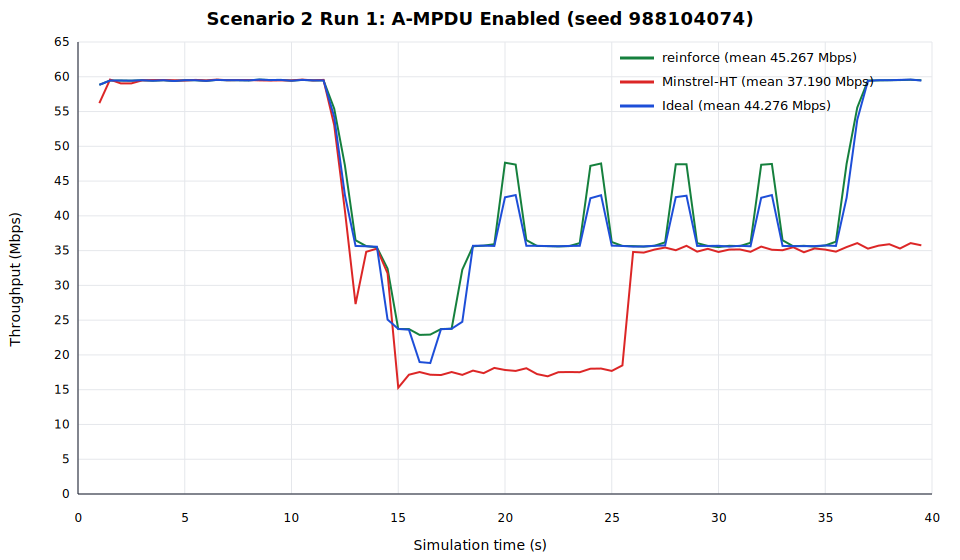
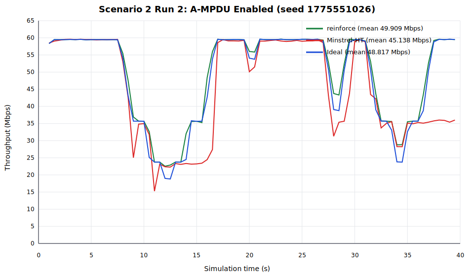
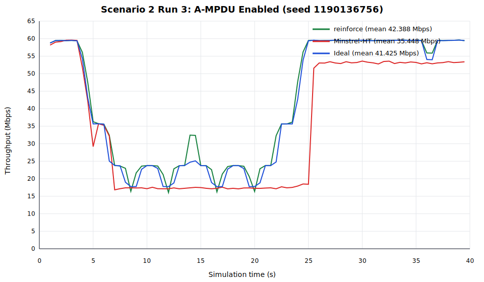
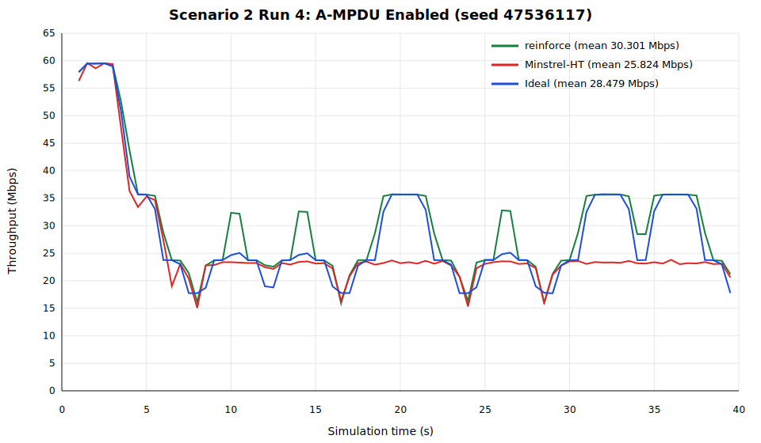
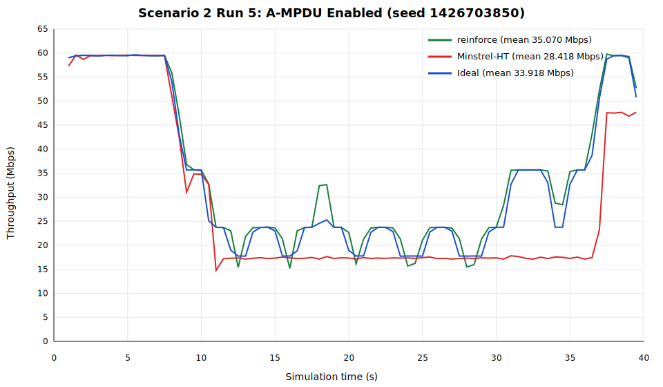

# 场景2开启聚合成功实验归档

归档时间：2026-07-24（Asia/Shanghai）。

本目录保存训练到 episode 1401 的冻结 Reinforce 模型、训练历史、源码快照，以及 Reinforce、Minstrel-HT、Ideal 在场景2中的5组独立评估。场景2是随机移动，因此不对5条轨迹做按距离平均；每个 seed 单独生成一张“时间—吞吐量” SVG，图例标注该轮的全程平均吞吐量。

## 目录结构

- `code/`：训练、推理、ns-3场景、速率控制环境、绘图和5轮评估源码快照。
- `models/`：episode 1401 的 final、best 和包含 Adam/RNG 状态的 checkpoint。
- `results/training/`：1401轮训练 history 和训练统计图。
- `results/comparison_5run/`：5轮摘要 CSV 和5张独立对比 SVG。
- `results/comparison_5run/raw/`：三种算法每轮的原始时间—距离—吞吐量 CSV，共15个文件。

checkpoint 记录 `episode=1401` 和 `gradient_updates=1401`。final、best 和 checkpoint 中的策略张量已逐张验证完全一致，训练 history 共1401行连续记录。

## 网络与仿真场景

- ns-3：3.36.1，`optimized` 构建。
- 拓扑：单 AP、单 STA；AP固定在 `(0,0,0)`，STA初始在 `(1,0,0)`。
- 移动：`ns3::RandomWalk2dMobilityModel`，严格沿 x 轴在0–24 m内移动。
- 速度：3.0 m/s；每2 s独立随机选择 `+x` 或 `-x`，边界处反弹。
- 每个 episode：40 s；UDP流量从0.5 s开始。
- Wi-Fi：IEEE 802.11n、5 GHz、信道36、20 MHz、单空间流。
- PHY：YansWifiPhy + NistErrorRateModel；发射功率20 dBm，噪声系数0 dB。
- 信道：ConstantSpeedPropagationDelayModel + LogDistancePropagationLossModel。
- 路损：1 m参考损耗66.6777 dB，指数3。
- 业务：AP到STA的持续 UDP下行，60 Mbps，payload 1420 bytes。
- 吞吐量采样：每0.5 s一次，每轮78个有效采样点。
- A-MPDU：开启，`BE_MaxAmpduSize=65535` bytes。
- 动作空间：HT MCS0–MCS7；控制帧使用 HtMcs0。
- Reinforce决策粒度：每个完成的 PPDU/A-MPDU 后交换一次 observation/action。

Minstrel-HT 使用 ns-3 原生 `ns3::MinstrelHtWifiManager`，Ideal 使用 `ns3::IdealWifiManager`。同一轮的三种算法使用相同 seed；已验证三者的78个距离采样点逐点完全相同。

## Reinforce 模型与训练

- SNR转为dB后使用95个 RBF 特征：中心5–52 dB，间隔0.5 dB，`sigma=0.6 dB`。
- 额外5维：SNR有效标志、归一化竞争窗口、当前MCS、按60.9 Mbps归一化的吞吐量、成功MPDU比例。
- 网络：`100 -> 256 -> 256 -> 256 -> 8`，隐藏层 ReLU，输出8维 softmax，参数量159,496。
- 每个40 s episode内冻结策略，episode结束后执行一次 Adam 更新。
- 学习率 `1e-4`，`gamma=0.99`，训练 `epsilon=0.3`，entropy coefficient `0.05`。
- 行为采样：30%均匀随机动作，70%从策略 softmax 分布采样。
- actor loss 使用目标/行为概率 `detach(pi/q)` importance correction。
- advantage按96个SNR区计算：95个0.5 dB RBF区加1个无效SNR区，区内标准化后对非空区等权平均。
- A-MPDU开启时 MCS0–MCS7 参考 goodput 为 `[5.9, 12.0, 18.1, 24.2, 36.4, 48.7, 54.8, 60.9]` Mbps。
- 评估使用 final 模型的冻结贪心策略，`epsilon=0`，不更新参数。

## 5组独立评估

种子由 `random.Random(20260724)` 在 `[1, 2,000,000,000)` 中无放回抽取。每轮的平均吞吐量如下，这些平均值仅是各自轨迹内的78个时间采样点的算术平均，未跨轨迹平均。

| Run | Seed | Reinforce (Mbps) | Minstrel-HT (Mbps) | Ideal (Mbps) |
|---:|---:|---:|---:|---:|
| 1 | 988104074 | 45.267269 | 37.189733 | 44.275747 |
| 2 | 1775551026 | 49.909431 | 45.137941 | 48.816836 |
| 3 | 1190136756 | 42.387655 | 35.447864 | 41.425254 |
| 4 | 47536117 | 30.300615 | 25.823901 | 28.478933 |
| 5 | 1426703850 | 35.070358 | 28.418065 | 33.918336 |











## 模型文件

- 冻结推理：`models/reinforce-episode1401-final.pt`
- 同轮策略副本：`models/reinforce-episode1401-best.pt`
- 续训 checkpoint：`models/reinforce-episode1401-checkpoint.pt`

## 复现5轮评估

在 ns-3 仓库根目录执行：

```bash
REPRODUCTION_NS3_PROFILE=optimized \
OMP_NUM_THREADS=1 MKL_NUM_THREADS=1 OPENBLAS_NUM_THREADS=1 \
ns3ai_env/bin/python -B \
'scratch/success_reproduct/场景2开启聚合/code/evaluate_reinforce_5run.py'
```

该命令使用相同5个 seed 覆盖同名 raw CSV、summary 和5张 SVG，不进行训练。
